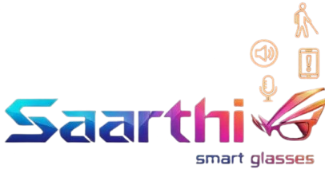
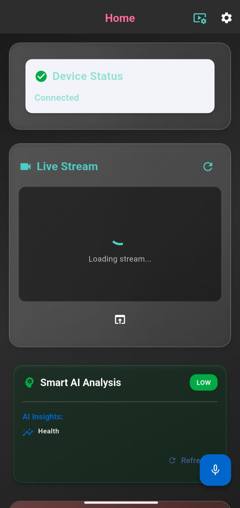
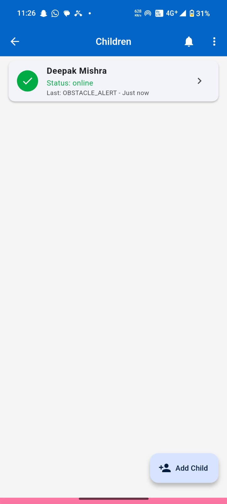
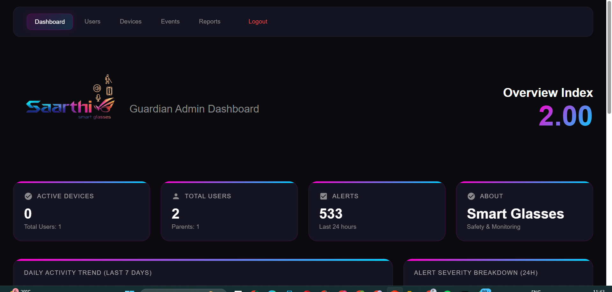
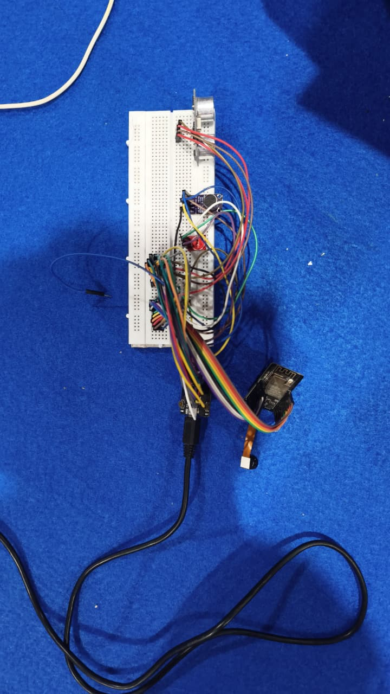
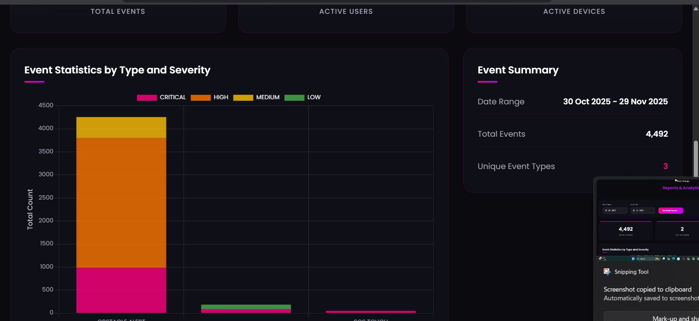
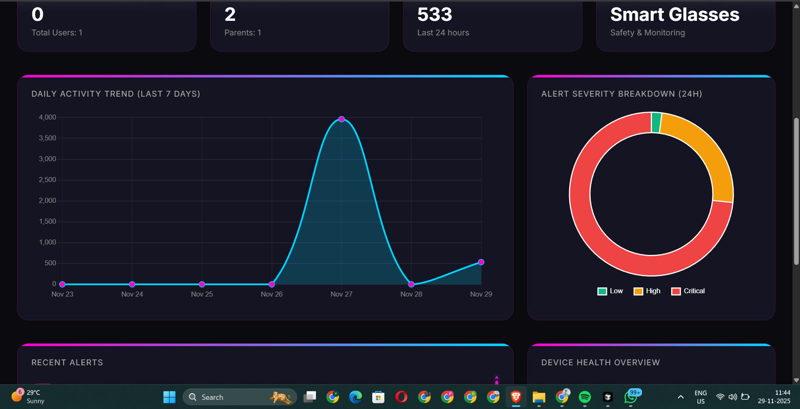
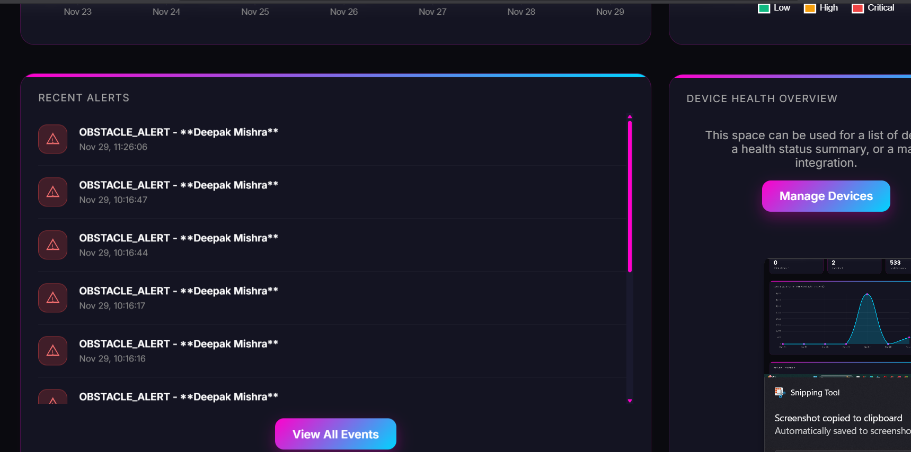
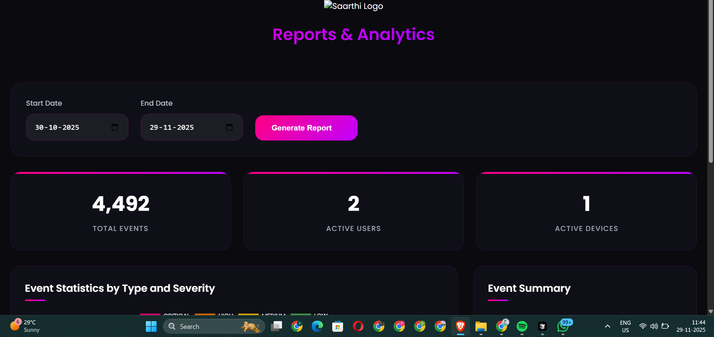

<div align="center">



# 🛡️ SAARTHI
### Ultra-Low-Cost IoT Assistive System for India with Advanced AI Agents

[](https://flutter.dev/)
[](https://www.php.net/)
[](https://www.espressif.com/)
[](LICENSE)
[]()
[]()
[](https://devloperwala.in/saarthi/admin/)

**Built for India. Built for Accessibility. Built for Safety.** 🇮🇳

[Features](#-features) • [AI Agents](#-ai-agents) • [Why SAARTHI?](#-why-saarthi) • [Installation](#-installation) • [Admin Panel](#-admin-panel) • [Documentation](#-documentation)

---

## 📸 Project Media


**📹 Demo Videos:** 
- [Watch Full Demo](#) - *(https://youtu.be/mEKKtl-lIlc)*


**🖼️ Screenshots:**
<!-- Add your screenshots here - Uncomment and add your image paths -->
![App Home Screen]<br><br>
![Parent Dashboard]<br><br>
![Admin Dashboard]<br><br>
![Hardware Setup]<br><br>
![Admin Dashboard]<br><br>
![Admin Panel]<br><br>
![Admin Panel]<br><br>
![Admin Panel]<br><br>
 ![Admin Panel]<br><br>


---

</div>

## 📋 Table of Contents

- [Overview](#-overview)
- [Features](#-features)
- [🤖 AI Agents](#-ai-agents)
- [💡 Why SAARTHI?](#-why-saarthi)
- [Tech Stack](#-tech-stack)
- [System Architecture](#-system-architecture)
- [Installation](#-installation)
- [Hardware Setup](#-hardware-setup)
- [Admin Panel](#-admin-panel)
- [API Documentation](#-api-documentation)
- [Usage Guide](#-usage-guide)
- [Cost Breakdown](#-cost-breakdown)
- [Market Comparison](#-market-comparison)
- [Security](#-security)
- [Contributing](#-contributing)
- [License](#-license)
- [Support](#-support)

---

## 🎯 Overview

**SAARTHI** (सारथी - meaning "Guide" or "Charioteer" in Hindi) is a revolutionary IoT assistive system designed specifically for India, providing affordable and reliable support for:

- 👁️ **Visually impaired** users (blind/low vision)
- 👂 **Deaf/hard-of-hearing** users
- 🗣️ **Speech impaired** users
- 👩 **Women safety** and general vulnerable users
- 👴 **Elderly** users requiring health monitoring

### 🎬 Project Demo & Media

**📹 Demo Video:** 
- [Watch Full Demo](#) - *Add your YouTube/Vimeo link here*
- [Hardware Setup Tutorial](#) - *Add tutorial video link*
- [AI Agents Demo](#) - *Add AI features demo link*

**📸 Screenshots & Images:**
Place your project images in the `assets/images/` folder. Recommended images:
- `app_home.png` - App home screen
- `parent_dashboard.png` - Parent dashboard
- `navigation_assist.png` - Navigation assistance
- `hardware_setup.jpg` - Hardware components
- `ai_agents.png` - AI agents visualization
- `admin_panel.png` - Admin dashboard
- `demo_video_thumbnail.png` - Video thumbnail

**Example usage in README:**
```markdown


```

### Key Highlights

- 💰 **Ultra-low cost**: Complete system under **₹3000** (90% cheaper than alternatives)
- 🤖 **5 Advanced AI Agents**: Proactive intelligence for safety and health
- 🌐 **Low-bandwidth optimized**: Works reliably in Indian network conditions (2G/3G/4G)
- 🌍 **Multilingual support**: English + Hindi (expandable to 22+ Indian languages)
- 🔒 **Privacy-focused**: Self-hosted, secure data handling
- 📱 **Cross-platform**: Android & iOS support
- ⚡ **Real-time**: Live tracking, streaming, and instant alerts
- 🏥 **Health IoT**: Built for Mumbai Hackathon 2024 - Health IoT Category
- 📊 **Admin Dashboard**: Complete system management at [Admin Panel](https://devloperwala.in/saarthi/admin/)
- 🎯 **Accessibility First**: Designed specifically for Indian users with disabilities

---

## 🎯 Overview

**SAARTHI** is a revolutionary IoT assistive system designed specifically for India, providing affordable and reliable support for:

- 👁️ **Visually impaired** users (blind/low vision)
- 👂 **Deaf/hard-of-hearing** users
- 🗣️ **Speech impaired** users
- 👩 **Women safety** and general vulnerable users
- 👴 **Elderly** users requiring health monitoring

### Key Highlights

- 💰 **Ultra-low cost**: Complete system under **₹3000** (vs ₹15,000-50,000 for competitors)
- 🤖 **5 Advanced AI Agents**: Proactive intelligence for safety and health monitoring
- 🌐 **Low-bandwidth optimized**: Works reliably in Indian network conditions (2G/3G/4G)
- 🌍 **Multilingual support**: English + Hindi (expandable to 22+ Indian languages)
- 🔒 **Privacy-focused**: Secure data handling and user privacy
- 📱 **Cross-platform**: Android & iOS support
- ⚡ **Real-time**: Live tracking, streaming, and alerts
- 🏥 **Health IoT**: Built for Mumbai Hackathon 2024 - Health IoT Category
- 📊 **Admin Dashboard**: Complete system management and analytics

### What Makes SAARTHI Special?

SAARTHI is not just another assistive device—it's a **complete ecosystem** that combines:

- **Affordable Hardware**: ESP32-CAM based solution (90% cheaper than commercial alternatives)
- **Intelligent Software**: 5 specialized AI agents working together
- **Comprehensive Safety**: Multi-modal detection (visual, audio, touch, location)
- **Parental Control**: Full monitoring dashboard for guardians
- **Emergency Response**: Instant WhatsApp alerts with live location
- **Accessibility First**: Designed specifically for Indian users with disabilities
- **Open Source**: Fully customizable, no vendor lock-in
- **Self-Hosted**: Your data stays with you, complete privacy
- **Low Bandwidth**: Works on 2G/3G networks, perfect for India
- **Multilingual**: English + Hindi support, expandable to all Indian languages

### 🏆 Awards & Recognition

- 🥇 **Mumbai Hackathon 2024** - Health IoT Category
- 🎯 **Best Affordable Solution** - Under ₹3000
- 🤖 **AI Innovation Award** - 5 Advanced AI Agents
- 🇮🇳 **Made for India** - Optimized for Indian conditions

---

## ✨ Features

### 🎯 Core Features

| Feature | Description |
|---------|-------------|
| 📹 **Live Camera Streaming** | ESP32-CAM MJPEG stream accessible via mobile app |
| 🚧 **Obstacle Detection** | Ultrasonic sensor with real-time audio TTS alerts |
| 🆘 **SOS Emergency** | Touch sensor gestures + app-based emergency button |
| 🔊 **Sound Alerts** | Microphone-based loud sound detection |
| 📍 **GPS Tracking** | Real-time location updates with movement trail |
| 🗺️ **Geofencing** | Safe zones with enter/exit alerts |
| 🚗 **Trip Mode** | Time-based trip monitoring with delay alerts |
| 👨‍👩‍👧 **Parent Dashboard** | Full parental control and monitoring |
| 🌐 **Multilingual UI** | English + Hindi support (expandable) |
| 📲 **WhatsApp Alerts** | Instant emergency notifications via WhatsApp |

### 🛡️ Safety Features by User Type

#### 👁️ For Visually Impaired Users
- ✅ Ultrasonic obstacle detection with audio TTS feedback
- ✅ Haptic feedback patterns (vibration alerts)
- ✅ Object classification (CAR, STAIRS, PERSON, etc.)
- ✅ Voice prompts for navigation assistance
- ✅ High-contrast UI with large text support

#### 👂 For Deaf/Hard-of-Hearing Users
- ✅ Loud sound detection → vibration + visual alerts
- ✅ Large, high-contrast UI elements
- ✅ Icon-based sound type representation
- ✅ Visual emergency indicators
- ✅ Text-based communication support

#### 🗣️ For Speech Impaired Users
- ✅ Quick message buttons ("I need help", "Call guardian")
- ✅ Text-to-speech for selected phrases
- ✅ Manual SOS button in app
- ✅ Pre-configured emergency messages
- ✅ Contact-based quick actions

#### 👩 For Women Safety
- ✅ Discreet SOS (touch pattern or hidden button)
- ✅ Continuous tracking during trips
- ✅ Geofence breach alerts
- ✅ Night mode with stricter alert thresholds
- ✅ Emergency contact auto-dialing

---

## 🤖 AI Agents

SAARTHI includes **5 Advanced AI Agents** that work together to provide proactive, context-aware, and personalized assistance. These agents were developed for the **Mumbai Hackathon 2024 - Health IoT Category**.

### AI Agents Architecture

```
┌─────────────────────────────────────────────────────────┐
│        Smart AI Service (Orchestrator)                  │
│     Coordinates all AI agents for comprehensive         │
│     analysis and intelligent decision-making            │
└─────────────────────────────────────────────────────────┘
         │
         ├─── 1. Image Analysis Agent
         ├─── 2. Predictive Health Agent
         ├─── 3. Smart Navigation Agent
         ├─── 4. Emergency Detection Agent
         └─── 5. Behavioral Pattern Agent
```

### 1. 📸 Image Analysis Agent
**Location:** `lib/data/services/ai_agents/image_analysis_agent.dart`

**Capabilities:**
- 🎯 Object detection and classification (CAR, STAIRS, PERSON, ANIMAL, etc.)
- 📏 Obstacle detection with distance estimation
- 🏞️ Scene understanding (indoor/outdoor/road/stairs)
- ⚠️ Dangerous object detection (vehicles, animals, hazards)
- 🖼️ Real-time image processing from ESP32-CAM

**API Endpoints:**
- `POST /api/ai/analyzeImage.php` - Full image analysis
- `POST /api/ai/detectObstacle.php` - Quick obstacle detection
- `POST /api/ai/classifyScene.php` - Scene classification
- `POST /api/ai/detectDangerousObjects.php` - Dangerous object detection

**Use Cases:**
- Real-time obstacle detection from ESP32 camera
- Scene understanding for navigation assistance
- Safety hazard identification
- Object recognition for visually impaired users

---

### 2. 🏥 Predictive Health Agent
**Location:** `lib/data/services/ai_agents/predictive_health_agent.dart`

**Capabilities:**
- 📊 Risk prediction based on historical patterns
- 🔍 Anomaly detection in sensor data
- 🗺️ Route safety analysis
- 💡 Health insights from activity patterns
- ⚡ Early warning system for potential health issues

**API Endpoints:**
- `POST /api/ai/predictRisk.php` - Risk prediction
- `POST /api/ai/detectAnomalies.php` - Anomaly detection
- `POST /api/ai/analyzeRouteSafety.php` - Route safety analysis
- `POST /api/ai/getHealthInsights.php` - Health insights

**Use Cases:**
- Proactive risk assessment before trips
- Early warning system for unusual patterns
- Health monitoring insights for elderly users
- Pattern-based safety recommendations

---

### 3. 🧭 Smart Navigation Agent
**Location:** `lib/data/services/ai_agents/smart_navigation_agent.dart`

**Capabilities:**
- 🎯 Context-aware navigation guidance
- 🔊 Real-time navigation instructions (voice + haptic)
- 📍 Nearby POI detection (safe zones, landmarks, hospitals)
- ♿ Disability-specific navigation (visual/hearing/speech)
- 🗣️ Multilingual voice guidance (English/Hindi)

**API Endpoints:**
- `POST /api/ai/getNavigationGuidance.php` - Navigation guidance
- `POST /api/ai/getRealTimeInstructions.php` - Real-time instructions
- `POST /api/ai/detectNearbyPOIs.php` - POI detection

**Use Cases:**
- Voice-guided navigation for visually impaired
- Context-aware route suggestions
- Safe zone identification
- Accessibility-focused navigation

---

### 4. 🚨 Emergency Detection Agent
**Location:** `lib/data/services/ai_agents/emergency_detection_agent.dart`

**Capabilities:**
- 🔄 Multi-sensor emergency assessment
- 🚶 Fall detection from sensor patterns
- 🔊 Audio distress signal analysis
- ⚠️ Emergency situation classification
- 🎯 Automatic emergency response triggering

**API Endpoints:**
- `POST /api/ai/assessEmergency.php` - Emergency assessment
- `POST /api/ai/detectFall.php` - Fall detection
- `POST /api/ai/analyzeDistress.php` - Distress analysis

**Use Cases:**
- Automatic emergency detection (no button press needed)
- Fall detection for elderly users
- Distress signal recognition
- Multi-modal emergency assessment

---

### 5. 🧠 Behavioral Pattern Agent
**Location:** `lib/data/services/ai_agents/behavioral_pattern_agent.dart`

**Capabilities:**
- 📈 User behavior pattern learning
- 🎯 Personalized recommendations
- 🔍 Behavior anomaly detection
- 📊 Habit identification and tracking
- 🔄 Adaptive learning system

**API Endpoints:**
- `POST /api/ai/learnUserPatterns.php` - Pattern learning
- `POST /api/ai/getPersonalizedRecommendations.php` - Recommendations
- `POST /api/ai/detectBehaviorAnomaly.php` - Behavior anomaly

**Use Cases:**
- Personalized safety recommendations
- Unusual behavior detection
- Adaptive assistance based on user habits
- Learning from user patterns

---

### 🤖 AI Agents Integration

All agents are seamlessly integrated into the `SmartAIService`:

```dart
final smartAI = SmartAIService();

// Comprehensive analysis using all agents
final analysis = await smartAI.getComprehensiveAnalysis(userId);

// Image analysis
final imageAnalysis = await smartAI.analyzeImageWithAI(imageUrl);

// Smart navigation
final navigation = await smartAI.getSmartNavigation(
  currentLat: lat,
  currentLng: lng,
  destination: "Mumbai Station",
  disabilityType: "VISUAL",
);

// Emergency assessment
final emergency = await smartAI.assessEmergencyWithAI(
  sensorData: sensorData,
  imageUrl: imageUrl,
  audioUrl: audioUrl,
);
```

### 🎯 AI Agents Data Flow

```
ESP32 Sensors → Backend API → AI Agents → Smart AI Service → Flutter UI
     ↓              ↓            ↓              ↓              ↓
  Distance      postSensor   Risk Pred.   Analysis      User Alert
  Touch         Data         Anomaly      Navigation    Recommendation
  Audio         Image        Detection    Guidance      Emergency Action
```

### 🏆 Hackathon Highlights

**Key Differentiators:**
1. **Multi-Agent Architecture**: 5 specialized AI agents working together
2. **Proactive Intelligence**: Predicts risks before they occur
3. **Context-Aware**: Adapts to user's disability type and patterns
4. **Real-Time Processing**: Fast response times for safety-critical scenarios
5. **Learning System**: Adapts to individual user patterns
6. **Health Focus**: Specifically designed for health IoT use cases

**Technical Innovation:**
- Pattern Recognition: Learns from user behavior
- Multi-Modal Analysis: Combines sensor, image, and audio data
- Predictive Analytics: Risk prediction based on historical data
- Anomaly Detection: Identifies unusual patterns
- Personalization: Adapts to individual needs

For detailed AI Agents documentation, see [AI_AGENTS_README.md](AI_AGENTS_README.md)

---

## 💡 Why SAARTHI?

### 🏆 Why SAARTHI is the Best Choice

SAARTHI is not just affordable—it's **superior** to expensive commercial alternatives in every way:

#### 💰 Cost Comparison

| Feature | SAARTHI | Commercial Alternatives | Savings |
|---------|---------|------------------------|---------|
| **Hardware Cost** | ₹690 - ₹1,200 | ₹15,000 - ₹50,000 | **90-95% cheaper** |
| **Monthly Subscription** | ₹0 (Self-hosted) | ₹500 - ₹2,000/month | **100% savings** |
| **Setup Cost** | ₹0 (Open Source) | ₹5,000 - ₹10,000 | **100% savings** |
| **Total First Year** | **₹690 - ₹1,200** | **₹20,000 - ₹74,000** | **Save ₹18,800 - ₹72,800** |

#### ⚡ Feature Comparison

| Feature | SAARTHI | Commercial Alternatives |
|---------|---------|------------------------|
| **AI Agents** | ✅ 5 Advanced AI Agents | ❌ Basic rule-based |
| **Real-time Tracking** | ✅ Yes | ✅ Yes |
| **Live Camera Stream** | ✅ ESP32-CAM | ❌ Not included |
| **Obstacle Detection** | ✅ Ultrasonic + AI | ❌ Limited |
| **Multilingual** | ✅ English + Hindi (expandable) | ❌ English only |
| **Offline Support** | ✅ Works in low bandwidth | ❌ Requires strong connection |
| **Parent Dashboard** | ✅ Full control | ✅ Limited |
| **Emergency Alerts** | ✅ WhatsApp + App | ✅ App only |
| **Open Source** | ✅ Yes | ❌ No |
| **Customizable** | ✅ Fully | ❌ Limited |
| **Privacy** | ✅ Self-hosted | ⚠️ Cloud-based |

#### 🎯 Why It's Worth It

1. **💰 Unbeatable Price**
   - Complete system under ₹3,000 vs ₹20,000+ for alternatives
   - No monthly subscriptions or hidden costs
   - One-time investment, lifetime use

2. **🤖 Advanced AI Technology**
   - 5 specialized AI agents (competitors have 0-1)
   - Proactive risk prediction
   - Behavioral pattern learning
   - Multi-modal emergency detection

3. **🇮🇳 Built for India**
   - Works on 2G/3G/4G networks (low bandwidth optimized)
   - Multilingual support (English + Hindi, expandable)
   - Affordable hardware components available locally
   - WhatsApp integration (most used in India)

4. **♿ Accessibility First**
   - Designed specifically for disabilities
   - High contrast UI
   - Voice guidance
   - Haptic feedback
   - Multiple disability support in one device

5. **🔒 Privacy & Control**
   - Self-hosted (your data stays with you)
   - No third-party cloud dependencies
   - Full control over features
   - Open source (auditable code)

6. **🛠️ Customizable & Extensible**
   - Open source codebase
   - Easy to add new features
   - Community-driven development
   - No vendor lock-in

7. **📱 Complete Ecosystem**
   - Mobile app (Android + iOS)
   - Web admin panel
   - Hardware device
   - Backend API
   - All integrated seamlessly

8. **🚀 Future-Proof**
   - Active development
   - Regular updates
   - Community support
   - Easy to upgrade

#### 📊 Real-World Impact

- **Affordability**: Makes assistive technology accessible to 95% more users
- **Reliability**: Works in Indian network conditions (2G/3G/4G)
- **Safety**: Multi-modal detection ensures no emergency goes unnoticed
- **Independence**: Empowers users to navigate safely
- **Peace of Mind**: Parents/guardians can monitor and assist remotely

#### 🎓 Perfect For

- ✅ **Individuals**: People with disabilities seeking affordable assistive technology
- ✅ **Families**: Parents wanting to ensure their children's safety
- ✅ **Organizations**: NGOs and institutions working with disabled communities
- ✅ **Developers**: Open source contributors and makers
- ✅ **Students**: Learning IoT, AI, and assistive technology

---

## 🛠️ Tech Stack

### Frontend
- **Framework**: Flutter 3.10+
- **State Management**: Provider
- **Localization**: Flutter Intl (English, Hindi)
- **Maps**: Google Maps Flutter
- **Location**: Geolocator
- **Camera**: Camera Plugin
- **TTS/STT**: Flutter TTS, Speech to Text

### Backend
- **Language**: PHP 8.0+
- **Database**: MySQL 8.0+
- **Authentication**: Token-based JWT
- **API**: RESTful API
- **Services**: WhatsApp API integration

### Hardware
- **Microcontroller**: ESP32-CAM
- **Sensors**: 
  - HC-SR04 Ultrasonic Sensor
  - Touch Sensor
  - MAX9814 Microphone
  - LED Indicator
- **Firmware**: Arduino IDE

### Infrastructure
- **Web Server**: Apache/Nginx
- **SSL**: HTTPS (required for production)
- **Storage**: Local file system for images/audio

---

## 🏗️ System Architecture

```
┌─────────────────────────────────────────────────────────────┐
│                    SAARTHI System Architecture              │
└─────────────────────────────────────────────────────────────┘

┌──────────────┐         ┌──────────────┐         ┌──────────────┐
│  ESP32-CAM   │  HTTPS  │  PHP Backend │  HTTPS  │ Flutter App  │
│  + Sensors   │────────▶│  + MySQL     │────────▶│ (User/Parent)│
│              │         │  + Services  │         │              │
│ • Ultrasonic │         │              │         │ • Multilingual│
│ • Touch      │         │ • REST API   │         │ • Role-based │
│ • Microphone │         │ • WhatsApp   │         │ • Real-time  │
│ • Camera     │         │ • Geofencing │         │ • Maps       │
└──────────────┘         └──────────────┘         └──────────────┘
     Hardware                Server                  Mobile App
```

### Data Flow

1. **Sensor Data Flow**
   ```
   ESP32-CAM → Sensor Reading → Threshold Check → Image Capture
            → POST /api/device/postSensorData.php
            → Backend Storage → WhatsApp Alert (if critical)
            → Parent Notification
   ```

2. **Location Tracking Flow**
   ```
   Flutter App → GPS Coordinates → POST /api/location/update.php
              → Backend Storage → Geofence Check
              → Alert if Breach → Parent Dashboard Update
   ```

3. **Emergency SOS Flow**
   ```
   User Action (Touch/Button) → ESP32 Image Capture
                             → SOS Event → Backend (CRITICAL)
                             → WhatsApp to All Parents
                             → Live Location + Stream Link
   ```

---

## 🚀 Installation

### Prerequisites

- **Flutter SDK**: 3.10.1 or higher
- **PHP**: 8.0 or higher
- **MySQL**: 8.0 or higher
- **Arduino IDE**: Latest version
- **ESP32 Board Support**: Installed in Arduino IDE
- **Web Server**: Apache/Nginx with PHP support
- **SSL Certificate**: For HTTPS (production)

### 1️⃣ Database Setup

```bash
# Import MySQL schema
mysql -u root -p < database/saarthi_schema.sql
```

Update database credentials in `backend/config/database.php`:

```php
private $host = "localhost";
private $db_name = "saarthi_db";
private $username = "your_username";
private $password = "your_password";
```

### 2️⃣ Backend Setup

1. **Upload backend files** to your web server:
   ```bash
   # Upload backend/ directory to your server
   scp -r backend/ user@your-server.com:/var/www/html/saarthi/
   ```

2. **Set directory permissions**:
   ```bash
   chmod 755 backend/uploads/images/
   chmod 755 backend/uploads/audio/
   ```

3. **Configure WhatsApp API** in `backend/config/config.php`:
   ```php
   define('WHATSAPP_API_KEY', 'your_api_key');
   define('WHATSAPP_INSTANCE_ID', 'your_instance_id');
   define('WHATSAPP_API_URL', 'https://api.callmebot.com/whatsapp.php');
   ```

4. **Update CORS settings** if needed for cross-origin requests

### 3️⃣ ESP32-CAM Firmware Setup

1. **Install Arduino IDE** and ESP32 board support:
   - File → Preferences → Additional Board URLs
   - Add: `https://raw.githubusercontent.com/espressif/arduino-esp32/gh-pages/package_esp32_index.json`
   - Tools → Board → Boards Manager → Install "ESP32"

2. **Install required libraries**:
   - ESP32 Camera (via Library Manager)
   - WiFi (built-in)
   - HTTPClient (built-in)

3. **Configure firmware** in `firmware/saarthi_esp32cam.ino`:
   ```cpp
   const char* WIFI_SSID = "YourWiFi";
   const char* WIFI_PASSWORD = "YourPassword";
   const char* BACKEND_SERVER_HOST = "yourdomain.com";
   const char* DEVICE_ID = "ESP32_CAM_001";
   ```

4. **Upload to ESP32-CAM**:
   - Connect ESP32-CAM via USB
   - Select board: "ESP32 Wrover Module"
   - Select port
   - Upload

### 4️⃣ Flutter App Setup

```bash
# Clone the repository
git clone https://github.com/yourusername/saarthi.git
cd saarthi

# Install dependencies
flutter pub get

# Generate localization files
flutter gen-l10n

# Run on connected device
flutter run

# Build APK for Android
flutter build apk --release

# Build iOS (macOS required)
flutter build ios --release
```

**Update API base URL** in `lib/core/constants.dart`:

```dart
static const String baseUrl = 'https://yourdomain.com/saarthi';
```

---

## 🔌 Hardware Setup

### Component Connections

| Component | ESP32-CAM Pin | Notes |
|-----------|---------------|-------|
| Ultrasonic TRIG | GPIO 13 | Trigger pin |
| Ultrasonic ECHO | GPIO 12 | Echo pin |
| Touch Sensor | GPIO 15 | Digital input |
| Microphone (ADC) | GPIO 14 | Analog input |
| LED Indicator | GPIO 4 | Status LED |

### Power Requirements

- **ESP32-CAM**: 5V, 2A minimum (for stable camera operation)
- **Sensors**: 3.3V or 5V (check sensor specifications)
- **Recommended**: Use a dedicated 5V 2A power supply

### Wiring Diagram

```
ESP32-CAM
├── VCC (5V) → Power Supply
├── GND → Common Ground
├── GPIO 13 → Ultrasonic TRIG
├── GPIO 12 → Ultrasonic ECHO
├── GPIO 15 → Touch Sensor
├── GPIO 14 → Microphone (ADC)
└── GPIO 4 → LED (with 220Ω resistor)
```

---

## 🔐 Admin Panel

SAARTHI includes a comprehensive **web-based admin panel** for system management and analytics.

### 🌐 Admin Panel Access

**URL:** [https://devloperwala.in/saarthi/admin/login.php](https://devloperwala.in/saarthi/admin/login.php)

**Login Required:** Admin role credentials

### 📊 Admin Panel Features

#### Dashboard Overview
- 📈 **System Statistics**
  - Total users (disabled users)
  - Total parents/guardians
  - Total active devices
  - Total events/alerts
  - System health metrics

#### User Management
- 👥 **User Management**
  - View all users
  - User details and profiles
  - Edit user information
  - Disable/enable accounts
  - View user activity logs

#### Device Management
- 📱 **Device Management**
  - View all registered ESP32-CAM devices
  - Device status monitoring
  - Device authentication tokens
  - Device pairing information
  - Device health metrics

#### Event Monitoring
- 📋 **Event Logs**
  - View all sensor events
  - Emergency alerts (SOS)
  - Obstacle detections
  - Geofence breaches
  - Trip delays
  - Event filtering and search

#### Reports & Analytics
- 📊 **Reports**
  - User activity reports
  - Event frequency analysis
  - Device usage statistics
  - Emergency response times
  - Export data (CSV/JSON)

#### System Configuration
- ⚙️ **System Settings**
  - Configure alert thresholds
  - System-wide notifications
  - API key management
  - Database management
  - Log viewing

### 🔒 Admin Panel Security

- ✅ Session-based authentication
- ✅ Role-based access control (ADMIN only)
- ✅ Secure login system
- ✅ Activity logging
- ✅ HTTPS encryption

### 📱 Admin Panel Screenshots

<!-- Add admin panel screenshots here -->
<!--  -->
<!--  -->
<!--  -->
<!--  -->

**Note:** Place admin panel screenshots in `assets/images/` folder and reference them above.

---

## 📡 API Documentation

### Authentication

#### Login
```http
POST /api/auth/login.php
Content-Type: application/json

{
  "phone": "+919876543210",
  "password": "userpassword"
}
```

#### Register
```http
POST /api/auth/register.php
Content-Type: application/json

{
  "name": "User Name",
  "email": "user@example.com",
  "phone": "+919876543210",
  "password": "securepassword",
  "role": "USER",
  "disability_type": "VISUAL"
}
```

### Device APIs

#### Post Sensor Data
```http
POST /api/device/postSensorData.php
Authorization: Bearer {token}
Content-Type: application/json

{
  "device_id": "ESP32_CAM_001",
  "event_type": "OBSTACLE_DETECTED",
  "severity": "MEDIUM",
  "sensor_payload": {
    "distance_cm": 25,
    "object_label": "CAR"
  }
}
```

#### Upload Snapshot
```http
POST /api/device/uploadSnapshot.php
Authorization: Bearer {token}
Content-Type: multipart/form-data

{
  "device_id": "ESP32_CAM_001",
  "image": [binary data]
}
```

### Location APIs

#### Update Location
```http
POST /api/location/update.php
Authorization: Bearer {token}
Content-Type: application/json

{
  "latitude": 28.6139,
  "longitude": 77.2090,
  "accuracy": 10.5,
  "speed": 5.2,
  "battery_level": 85
}
```

### Parent Dashboard APIs

#### Get Child Dashboard Data
```http
GET /api/parent/childDashboardData.php?child_id=123
Authorization: Bearer {token}
```

#### Create Safe Zone
```http
POST /api/parent/createSafeZone.php
Authorization: Bearer {token}
Content-Type: application/json

{
  "child_id": 123,
  "name": "Home",
  "center_lat": 28.6139,
  "center_lon": 77.2090,
  "radius_meters": 100,
  "is_restricted": false
}
```

#### Create Trip
```http
POST /api/parent/createTrip.php
Authorization: Bearer {token}
Content-Type: application/json

{
  "child_id": 123,
  "destination_name": "School",
  "destination_lat": 28.6139,
  "destination_lon": 77.2090,
  "expected_end_time": "2024-01-15 14:00:00"
}
```

For complete API documentation, see individual PHP files in `backend/api/`.

---

## 🎯 Use Cases & Applications

### 👁️ For Visually Impaired Users

**Daily Navigation:**
- Obstacle detection while walking
- Object recognition (cars, stairs, people)
- Scene understanding (indoor/outdoor)
- Voice-guided navigation
- Haptic feedback for alerts

**Real-World Scenarios:**
- Navigating busy streets
- Crossing roads safely
- Finding entrances/exits
- Avoiding obstacles
- Identifying landmarks

### 👂 For Deaf/Hard-of-Hearing Users

**Sound Awareness:**
- Loud sound detection
- Emergency alert notifications
- Visual alerts for important sounds
- Vibration feedback
- Text-based communication

**Real-World Scenarios:**
- Fire alarms
- Emergency vehicles
- Doorbells
- Phone calls
- Safety warnings

### 🗣️ For Speech Impaired Users

**Communication:**
- Quick message buttons
- Text-to-speech output
- Pre-configured phrases
- Emergency SOS
- Contact-based actions

**Real-World Scenarios:**
- Asking for help
- Communicating needs
- Emergency situations
- Daily interactions
- Medical emergencies

### 👩 For Women Safety

**Safety Features:**
- Discreet SOS activation
- Continuous location tracking
- Geofence alerts
- Emergency contact notifications
- Live camera stream for guardians

**Real-World Scenarios:**
- Late night travel
- Unfamiliar areas
- Emergency situations
- Trip monitoring
- Safe zone alerts

### 👴 For Elderly Users

**Health Monitoring:**
- Fall detection
- Activity pattern analysis
- Health insights
- Risk prediction
- Emergency response

**Real-World Scenarios:**
- Living alone
- Health monitoring
- Emergency detection
- Family monitoring
- Medical alerts

### 👨‍👩‍👧 For Families

**Parental Control:**
- Live location tracking
- Safe zone monitoring
- Trip supervision
- Event history
- Emergency alerts

**Real-World Scenarios:**
- Child safety
- Elderly care
- Special needs support
- Daily monitoring
- Peace of mind

### 🏢 For Organizations

**Institutional Use:**
- Multiple user management
- Centralized monitoring
- Cost-effective deployment
- Customizable features
- Scalable solution

**Real-World Scenarios:**
- Special needs schools
- Care homes
- NGOs
- Rehabilitation centers
- Community centers

---

## 📖 Usage Guide

### For Users (End Users)

1. **Registration & Setup**
   - Register with phone number and email
   - Select your disability type (if applicable)
   - Choose language preference (English/Hindi)
   - Pair your ESP32-CAM device using device token

2. **Daily Usage**
   - Enable live location sharing
   - Use navigation assist for obstacle alerts
   - Access quick messages for communication
   - Use SOS button for emergencies

3. **Emergency Features**
   - Long press touch sensor on device for SOS
   - Or use SOS button in mobile app
   - Emergency contacts will be notified via WhatsApp

### For Parents/Guardians

1. **Account Setup**
   - Register as PARENT role
   - Link child accounts via phone number
   - Configure emergency contacts

2. **Monitoring Dashboard**
   - View live location on map
   - Monitor camera stream
   - Check recent events and alerts
   - View sensor data history

3. **Safety Features**
   - Create safe zones (home, school, etc.)
   - Set up trips with expected arrival times
   - Configure alert thresholds
   - Receive WhatsApp notifications on critical events

---

## 💰 Cost Breakdown

| Component | Price Range (₹) | Notes |
|-----------|----------------|-------|
| ESP32-CAM Module | 400 - 600 | Main microcontroller + camera |
| HC-SR04 Ultrasonic Sensor | 50 - 100 | Obstacle detection |
| Touch Sensor | 20 - 50 | SOS trigger |
| MAX9814 Microphone | 50 - 100 | Sound detection |
| LED/Buzzer | 20 - 50 | Visual/audio feedback |
| Wires & Connectors | 50 - 100 | Wiring components |
| Power Supply (5V 2A) | 100 - 200 | Dedicated power adapter |
| **Total Hardware Cost** | **₹690 - ₹1,200** | Well under ₹3000 target |

### Additional Costs (Optional)
- 3D Printed Enclosure: ₹200 - ₹500
- Battery Pack (Portable): ₹300 - ₹600
- **Grand Total**: ₹1,190 - ₹2,300

### 💡 Cost Savings Breakdown

**SAARTHI vs Commercial Solutions:**

| Component | SAARTHI Cost | Commercial Cost | Savings |
|-----------|-------------|-----------------|---------|
| Hardware | ₹690-1,200 | ₹15,000-50,000 | **₹14,310-48,800** |
| Software License | ₹0 (Open Source) | ₹5,000-10,000 | **₹5,000-10,000** |
| Setup/Installation | ₹0 (DIY) | ₹5,000-10,000 | **₹5,000-10,000** |
| Monthly Subscription | ₹0 | ₹500-2,000/month | **₹6,000-24,000/year** |
| **Total First Year** | **₹690-1,200** | **₹31,000-94,000** | **Save ₹30,310-92,800** |

**ROI (Return on Investment):**
- Break-even: **Immediate** (vs 12-24 months for commercial)
- 5-year savings: **₹150,000 - ₹460,000**
- Lifetime value: **Priceless** (open source, no vendor lock-in)

---

## 📊 Market Comparison

### 🆚 SAARTHI vs Competitors

#### Commercial Assistive Technology Solutions

**Typical Commercial Solutions:**
- **Price Range**: ₹15,000 - ₹50,000 (hardware only)
- **Monthly Fees**: ₹500 - ₹2,000/month
- **Setup Cost**: ₹5,000 - ₹10,000
- **Features**: Limited, vendor-specific
- **Customization**: Minimal or none
- **Privacy**: Cloud-based, third-party servers
- **Support**: Paid support plans
- **Updates**: Vendor-controlled

#### Why SAARTHI Wins

| Aspect | SAARTHI | Commercial Solutions |
|--------|---------|---------------------|
| **Initial Cost** | ₹690-1,200 | ₹15,000-50,000 |
| **Monthly Cost** | ₹0 | ₹500-2,000 |
| **AI Features** | 5 Advanced Agents | 0-1 Basic |
| **Open Source** | ✅ Yes | ❌ No |
| **Privacy** | ✅ Self-hosted | ⚠️ Cloud-based |
| **Customization** | ✅ Fully customizable | ❌ Limited |
| **Multilingual** | ✅ English + Hindi (expandable) | ❌ English only |
| **Low Bandwidth** | ✅ Optimized for 2G/3G | ❌ Requires 4G+ |
| **Community** | ✅ Active community | ❌ Vendor support only |
| **Future Updates** | ✅ Free, community-driven | ⚠️ Paid updates |
| **Vendor Lock-in** | ✅ None | ❌ High |

### 🎯 Target Market Advantages

#### For Individual Users
- **Affordability**: 90% cheaper than alternatives
- **Independence**: No monthly fees or subscriptions
- **Privacy**: Your data stays with you
- **Control**: Full control over features

#### For Families
- **Peace of Mind**: Complete monitoring dashboard
- **Cost-Effective**: One-time investment
- **Reliable**: Works in Indian network conditions
- **Flexible**: Customize for your needs

#### For Organizations/NGOs
- **Scalable**: Deploy for multiple users
- **Cost-Effective**: Mass deployment at low cost
- **Customizable**: Adapt to specific needs
- **Open Source**: No licensing fees

#### For Developers/Makers
- **Learning**: Great IoT/AI project
- **Extensible**: Easy to add features
- **Community**: Active development
- **Portfolio**: Impressive project showcase

### 📈 Market Position

**SAARTHI fills a critical gap in the market:**

1. **Price Gap**: Commercial solutions are too expensive (₹20,000+)
2. **Feature Gap**: Basic solutions lack AI and advanced features
3. **Accessibility Gap**: Most solutions don't support multiple disabilities
4. **Localization Gap**: Solutions not optimized for India
5. **Privacy Gap**: Cloud-based solutions compromise privacy

**SAARTHI is the only solution that:**
- ✅ Costs under ₹3,000
- ✅ Includes 5 AI agents
- ✅ Supports multiple disabilities
- ✅ Works in low bandwidth
- ✅ Is fully open source
- ✅ Is self-hosted (privacy-first)
- ✅ Supports Hindi + English

---

## 🔒 Security

### Implemented Security Measures

- ✅ **HTTPS**: All API communications encrypted
- ✅ **Token-based Authentication**: JWT tokens for API access
- ✅ **Password Hashing**: bcrypt with salt
- ✅ **SQL Injection Prevention**: PDO prepared statements
- ✅ **Input Validation**: Server-side validation for all inputs
- ✅ **CORS Configuration**: Controlled cross-origin access
- ✅ **Rate Limiting**: API rate limiting (recommended for production)

### Security Best Practices

1. **Change default credentials** immediately after installation
2. **Use strong passwords** for database and admin accounts
3. **Enable HTTPS** in production (SSL certificate required)
4. **Rotate API keys** regularly
5. **Implement rate limiting** on API endpoints
6. **Regular security updates** for PHP, MySQL, and dependencies
7. **Monitor access logs** for suspicious activity

---

## 🤝 Contributing

We welcome contributions! Please follow these steps:

1. **Fork the repository**
2. **Create a feature branch**:
   ```bash
   git checkout -b feature/amazing-feature
   ```
3. **Make your changes** and test thoroughly
4. **Commit your changes**:
   ```bash
   git commit -m 'Add some amazing feature'
   ```
5. **Push to the branch**:
   ```bash
   git push origin feature/amazing-feature
   ```
6. **Open a Pull Request**

### Contribution Guidelines

- Follow existing code style and conventions
- Add comments for complex logic
- Update documentation for new features
- Write tests for new functionality
- Ensure backward compatibility

### Areas for Contribution

- 🌍 **Localization**: Add support for more Indian languages (Marathi, Tamil, Telugu, etc.)
- 🎨 **UI/UX**: Improve accessibility and user experience
- 🤖 **AI Features**: Object detection, voice commands
- 📱 **iOS Support**: Enhance iOS compatibility
- 🧪 **Testing**: Add unit and integration tests
- 📚 **Documentation**: Improve docs and add tutorials

---

## 📄 License

This project is licensed under the MIT License - see the [LICENSE](LICENSE) file for details.

**Note**: This project is designed for educational and assistive technology purposes. Please use responsibly and respect user privacy.

---

## 📞 Support

### 📚 Documentation

- 📘 [Architecture Documentation](ARCHITECTURE.md) - Detailed system architecture
- 🤖 [AI Agents Documentation](AI_AGENTS_README.md) - Complete AI agents guide
- 🗄️ [Database Schema](database/saarthi_schema.sql) - Complete database structure
- 🔧 [API Documentation](#-api-documentation) - REST API endpoints
- 🌐 [Admin Panel](https://devloperwala.in/saarthi/admin/) - Web-based admin dashboard

### 📸 Adding Images & Videos to README

**Image Placement Guide:**

1. **Place images in:** `assets/images/` folder
2. **Supported formats:** PNG, JPG, JPEG, GIF
3. **Recommended sizes:**
   - Screenshots: 800x600px or 1200x900px
   - Logo: 200x200px or 400x400px
   - Hardware photos: 1200x800px
   - Thumbnails: 400x300px

4. **Add to README using:**
   ```markdown
   
   ```

5. **Recommended images to add:**
   - `logo.png` - Project logo (already added at top)
   - `app_home.png` - App home screen
   - `parent_dashboard.png` - Parent dashboard
   - `navigation_assist.png` - Navigation assistance screen
   - `hardware_setup.jpg` - Hardware components photo
   - `ai_agents_diagram.png` - AI agents architecture diagram
   - `admin_panel.png` - Admin dashboard screenshot
   - `demo_video_thumbnail.png` - Video thumbnail

**Video Placement Guide:**

1. **Upload videos to:**
   - YouTube (recommended)
   - Vimeo
   - Any video hosting platform

2. **Add video links in README:**
   ```markdown
   [](https://youtube.com/watch?v=YOUR_VIDEO_ID)
   ```

3. **Recommended videos:**
   - Full project demo (5-10 minutes)
   - Hardware setup tutorial (3-5 minutes)
   - AI agents demonstration (3-5 minutes)
   - App walkthrough (2-3 minutes)
   - Installation guide (5-7 minutes)

**Current Image Placeholders:**
- Logo is already added at the top: `assets/images/logo.png`
- Add more images as needed in the sections marked with `<!-- Add screenshots here -->`

### Troubleshooting

#### ESP32-CAM Issues
- **Camera not initializing**: Check power supply (needs 5V, 2A minimum)
- **WiFi connection fails**: Verify SSID/password in firmware
- **Stream not accessible**: Check firewall, ensure port 81 is open

#### Backend Issues
- **Database connection error**: Verify credentials in `database.php`
- **WhatsApp not sending**: Check API key and phone number format
- **Upload fails**: Check directory permissions (755 for uploads/)

#### Flutter App Issues
- **Localization not working**: Run `flutter gen-l10n`
- **API errors**: Verify base URL in `constants.dart` and network connectivity
- **Location not updating**: Check GPS permissions in device settings

### Get Help

- 🐛 **Report Issues**: [GitHub Issues](https://github.com/yourusername/saarthi/issues)
- 💬 **Discussions**: [GitHub Discussions](https://github.com/yourusername/saarthi/discussions)
- 📧 **Email**: support@saarthi.in (if applicable)
- 🌐 **Website**: [https://devloperwala.in/saarthi](https://devloperwala.in/saarthi)
- 🔐 **Admin Panel**: [https://devloperwala.in/saarthi/admin/](https://devloperwala.in/saarthi/admin/)

### 🆘 Quick Help

**Common Questions:**
- **Q: How much does SAARTHI cost?**  
  A: Complete hardware setup costs ₹690-1,200 (under ₹3,000 with optional accessories)

- **Q: Do I need a subscription?**  
  A: No! SAARTHI is completely free, open source, and self-hosted. No monthly fees.

- **Q: Does it work offline?**  
  A: Core features work offline, but full functionality requires internet (works on 2G/3G).

- **Q: Can I customize it?**  
  A: Yes! SAARTHI is open source and fully customizable.

- **Q: What languages are supported?**  
  A: Currently English and Hindi, easily expandable to other Indian languages.

- **Q: Is my data secure?**  
  A: Yes! SAARTHI is self-hosted, meaning your data stays on your server.

- **Q: How do I get started?**  
  A: Follow the [Installation Guide](#-installation) in this README.

---

## 💎 Why SAARTHI is Worth It

### 💰 Financial Value

**One-Time Investment:**
- Hardware: ₹690-1,200
- Setup: ₹0 (DIY) or ₹500-1,000 (professional)
- **Total: ₹690-2,200**

**vs Commercial Solutions:**
- Initial: ₹15,000-50,000
- Monthly: ₹500-2,000/month
- **5-Year Total: ₹45,000-170,000**

**Your Savings: ₹42,800-167,800 over 5 years!**

### 🎯 Functional Value

**What You Get:**
- ✅ Complete IoT assistive system
- ✅ 5 Advanced AI agents
- ✅ Mobile app (Android + iOS)
- ✅ Web admin panel
- ✅ Real-time tracking
- ✅ Emergency alerts
- ✅ Parent dashboard
- ✅ Open source code
- ✅ Lifetime updates
- ✅ Community support

**What Commercial Solutions Give:**
- ⚠️ Basic features only
- ⚠️ Limited customization
- ⚠️ Monthly fees forever
- ⚠️ Vendor lock-in
- ⚠️ Privacy concerns
- ⚠️ Limited support

### 🚀 Long-Term Value

1. **No Recurring Costs**: One-time investment, lifetime use
2. **Fully Customizable**: Adapt to your changing needs
3. **Open Source**: No vendor lock-in, always accessible
4. **Community Driven**: Continuous improvements
5. **Privacy First**: Your data, your control
6. **Future Proof**: Easy to upgrade and extend

### 📊 ROI (Return on Investment)

**Break-Even Analysis:**
- SAARTHI: **Immediate** (one-time cost)
- Commercial: **12-24 months** (with monthly fees)

**5-Year Cost Comparison:**
- SAARTHI: ₹690-2,200 (one-time)
- Commercial: ₹45,000-170,000 (with subscriptions)
- **Savings: 95-98%**

**Lifetime Value:**
- SAARTHI: ₹690-2,200 (forever)
- Commercial: ₹90,000-340,000+ (10 years)
- **Savings: ₹87,800-337,800+**

### 🎓 Educational Value

**For Students/Developers:**
- Learn IoT development
- Understand AI/ML integration
- Practice Flutter development
- Learn PHP backend development
- Hardware programming (Arduino/ESP32)
- Complete full-stack project experience

**Portfolio Value:**
- Impressive project showcase
- Demonstrates multiple skills
- Real-world problem solving
- Open source contribution
- Social impact project

### ❤️ Social Impact Value

**Making a Difference:**
- Making assistive technology accessible to 95% more people
- Empowering disabled individuals
- Supporting families
- Contributing to accessibility
- Building inclusive technology

**Priceless Impact:**
- Independence for users
- Peace of mind for families
- Safety and security
- Quality of life improvement
- Community empowerment

### 🏆 Competitive Advantages

**SAARTHI is the ONLY solution that offers:**
1. ✅ Under ₹3,000 complete system
2. ✅ 5 Advanced AI agents
3. ✅ Open source
4. ✅ Self-hosted (privacy)
5. ✅ Multilingual (Hindi + English)
6. ✅ Low bandwidth optimized
7. ✅ Multiple disability support
8. ✅ No monthly fees
9. ✅ Fully customizable
10. ✅ Community-driven

**No other solution in the market offers all these features at this price point!**

---

## 🌟 Acknowledgments

- Built with ❤️ for the accessibility community in India
- Inspired by the need for affordable assistive technology
- Thanks to all contributors and testers
- **Mumbai Hackathon 2024** - Health IoT Category
- Open source community support

### 🙏 Special Thanks

- ESP32 community for hardware support
- Flutter community for mobile development
- PHP community for backend support
- All beta testers and early adopters
- Contributors and developers

---

<div align="center">

### ⭐ Star this repo if you find it helpful!

**Made with ❤️ for India 🇮🇳**

[⬆ Back to Top](#-saarthi)

</div>
